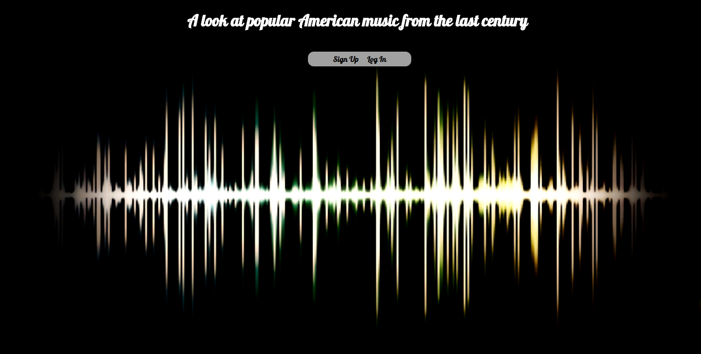
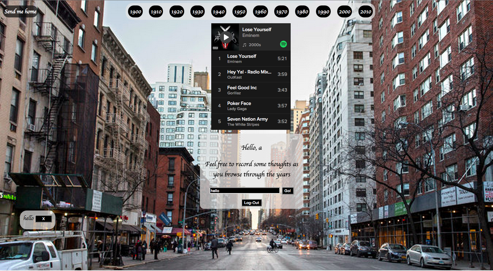

# Musical Timeline
 A Ruby on rails web application where a user can listen in on the past hits of the century in American popular music.

https://railstimeline.herokuapp.com/

## User Stories

 As a user I want to be able to
  - listen to music from each decade easily
  - reflect on the music of each decade by posting thoughts as comments
  - see a list of all my comments that I have recorded

## Technologies
  - Ruby on Rails
  - PostgreSQL
  - Javascript/jQuery
  - Backbone.js
  - Spotify Web Player

## Screenshots

